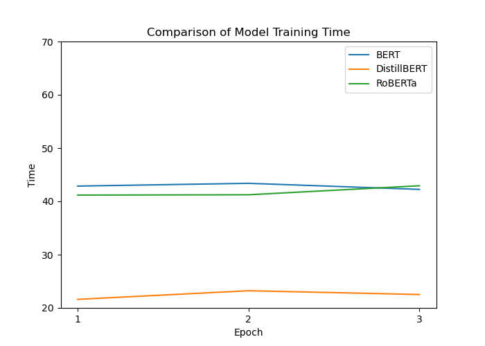

# LLM-Enhanced Approach to Forecast Stock Market Prices from Financial News
2023/2024 Fall YZV302E Deep Learning Project

* News Dataset: [Bloomberght September News](https://drive.google.com/file/d/1mJg4o7veZBX1ZJqGRz4IrLUMOHtTEaHc/view?usp=share_link)
* Stock Price Changes Dataset: [September Stock Price Changes](https://drive.google.com/file/d/1qqQ7saPBtYCXvGTQC2ajNYBlogbG34lf/view?usp=share_link)
* Trainable Dataset : [News and Stock Prices](https://drive.google.com/file/d/1qqQ7saPBtYCXvGTQC2ajNYBlogbG34lf/view?usp=share_link)

## Installation
Required packages:
- jupyter
- pandas==1.4.4
- scikit-learn==1.0.2
- matplotlib==3.5.2
- googletrans==4.0.0-rc.1
- requests==2.31.0
- beautifulsoup4==4.11.1
- datasets
- transformers
- peft
- evaluate
- torch

To install required packages run `pip install -r requirements.txt` in the project directory.

## Scraping
To scrape news from [BloombergHT](https://www.bloomberght.com) we used `DataCollection/news_scraping.ipynb` notebook. To scrape stock price changes we used `DataCollection/stock_market_prices.ipynb` notebook. You can run these notebooks to scrape data. 

You can arrange date range in the notebooks. Default date range is 31.08.2023 - 30.09.2023. You can change date range by changing `initial_date` and `end_date` variables in the notebooks.

## Preprocessing

To preprocess scraped data we used `DataCollection/data_processing.ipynb` notebook. These code combines scraped news and stock market prices data. THen it changes stock price changes to labels. After that it uses : 
```python
from googletrans import Translator 
import googletrans
```
to translate news to English. You can run this notebook to get `news_labels_en.csv` file.

## Training 

There are three training notebooks:
- `Finance_Classification_Bert.ipynb`: Train BERT model with news and stock features
- `Finance_Classification_Roberta.ipynb`: Train RoBERTa model with news and stock features
- `Finance_Classification`: Train DistilBERT model with news and stock features

In this training notebooks, we use `news_labels_en.csv` to train models with news and stock features. 

You need to download pretrained models if you don't have internet when you run code. You can download pretrained models from [here](https://huggingface.co/models). If you have internet, you don't need to download pretrained models. Modules will download pretrained models automatically. 

For the training with different arguments you can change the arguments in the `training_args` and `peft_config` variables in the notebooks. Default parameters are:

- `hyperparameters`:

        lr = 1e-3
        batch_size = 2
        num_epochs = 10

- `train_args`:

        output_dir= model_checkpoint + "-lora-text-classification",
        learning_rate=lr,
        per_device_train_batch_size=batch_size,
        per_device_eval_batch_size=batch_size,
        num_train_epochs=num_epochs,
        weight_decay=0.01,
        evaluation_strategy="epoch",
        save_strategy="epoch",
        load_best_model_at_end=True,
    

- `peft_config`:

        task_type="SEQ_CLS",
        r=32,#attention heads
        lora_alpha=4, # alpha scaling
        lora_dropout=0.01,
        target_modules = ['q_lin']

## Results

* Model Results for Hyperparameter Tuning : [Hyper Results](https://drive.google.com/drive/folders/1nXzR6_V4BE6VKsQLvhCzrsFLOlGUOH5d?usp=drive_link)

* Model Results for Model Comparison : [Results](https://drive.google.com/drive/folders/1u2LoNCpA9Lj2NOfbquRah2txCiwIz9se?usp=drive_link)

To get results of models on test data you can run `Result_Extractor.ipynb` notebook. It is a template for google colab. You can change the path of the models to get csv files of results. I have extracted hyperparameter tuning results in the `Figures/Aranged` folder. You can use them to get results of models on test data.
Model comparison results are in the [Results](https://drive.google.com/drive/folders/1u2LoNCpA9Lj2NOfbquRah2txCiwIz9se?usp=drive_link) same as the link above.

## Figures

* Figures for Hyperparameter Tuning (In the `Figures/hyper_figures` folder):
    - Accuracy

        

    - Time 

        

    - Learning Rate Change

        

    - Time (on BERT)

        

* Figures for Model Comparison (In the `Figures` folder):
    - Accuracy

        

    - Time 

        

## Interaction 

To interact with the models you can use `interaction/interaction.ipynb` notebook. 
There are `distil_model` folder for testing DistilBERT model to test different models you can easily change `model_checkpoint` variable in the notebook.

```python
text = "There is not bad affect on economy. The economy goes smoothly."

print("Model predictions:")
print("----------------------------")


inputs = tokenizer.encode(text, max_length = 512,return_tensors="pt")

logits = model(inputs).logits

predictions = torch.argmax(logits)

print(text + " - " + id2label[predictions.tolist()])  
```
To interact with the models you need to change `text` variable. You can get result like this:

```
Model predictions:
----------------------------
There is not bad affect on economy. The economy goes smoothly. - Stable
```


